# Android Dogfood Report: Logseq Chat

| Field | Value |
|-------|-------|
| Date | 2026-09-01 |
| Target | Android Flutter debug app on `logseq_android_36` and physical device `4a23a2e9` |
| Scope | Full Android UI/UX and E2E parity with iOS |

## Summary

| Severity | Count |
|----------|-------|
| Critical | 0 |
| High | 12 |
| Medium | 16 |
| Low | 0 |
| **Total** | **28** |

## Issues

### ISSUE-001: Add sync graph sheet controls overlap

| Field | Value |
|-------|-------|
| Severity | high |
| Category | visual / functional / UX |
| View | Graph picker → Add sync graph |
| Repro Video | N/A; deterministic static layout failure |
| Status | Fixed and verified on emulator |

**Description**

The sheet opens, but the Graph name field, Cancel action, and Add action occupy
the same horizontal area. The action toolbar is not anchored to the bottom, the
form hierarchy is unclear, and the oversized sheet leaves most of the surface
empty. The controls are difficult to read and reliably operate.

Expected: a Material bottom sheet with a readable form, stable keyboard
behavior, and bottom-aligned Cancel/Add actions.

**Repro Steps**

1. Sign in on the Android emulator and wait for the graph picker.
2. Tap **Add sync graph**.
3. Observe the overlapping form and actions.

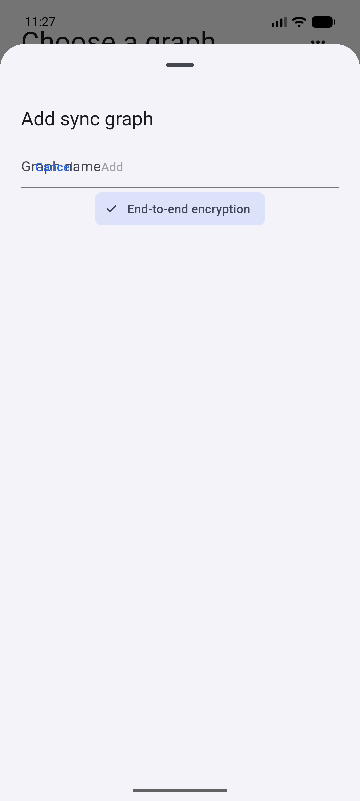

**Fix Verification**

The Flutter host now renders one bounded Material sheet child with a vertical
form, flexible spacing, and a bottom-aligned action row. Maestro verified the
field, toggle, disabled/enabled Add state, keyboard entry, and Cancel action.
No LUI, patch-generation, or RenderFlex errors were logged.

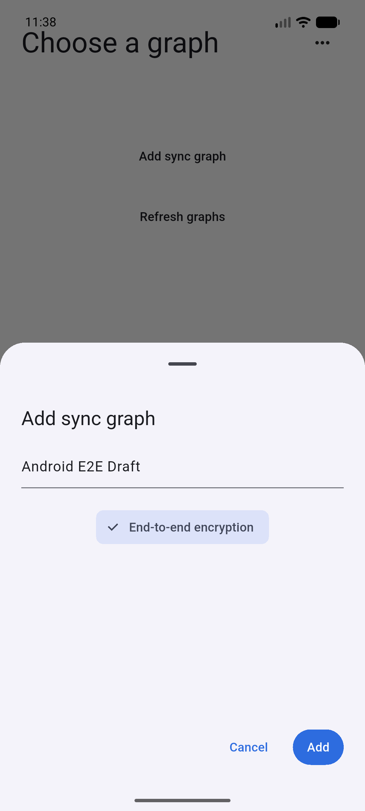

### ISSUE-002: Root content and overflow actions render inside system bars

| Field | Value |
|-------|-------|
| Severity | high |
| Category | visual / functional / accessibility |
| View | App frame, first observed on Graph picker |
| Repro Video | N/A; deterministic system-inset failure |
| Status | Fixed and verified on emulator |

**Description**

The Flutter root scaffold did not consume Android system insets. Titles and
toolbar actions rendered underneath the status bar; the Graph picker overflow
button was visible but its hit target was intercepted by the system bar.

Expected: every screen stays inside the Android status and navigation bar safe
areas, and visible toolbar actions remain tappable.

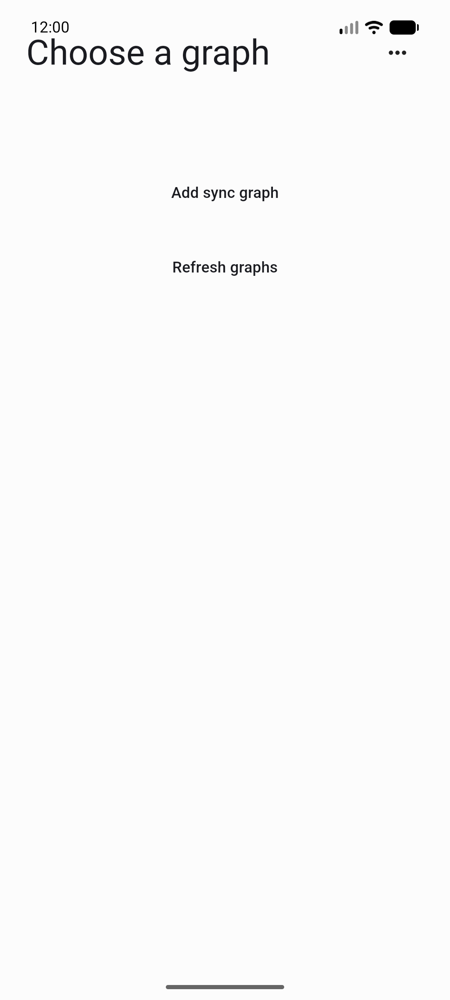

**Fix Verification**

The Android Flutter app frame now owns one root `SafeArea`. A widget regression
test verifies both top and bottom insets, and the overflow button is exposed as
an identified accessibility button. The Settings popup now opens reliably.

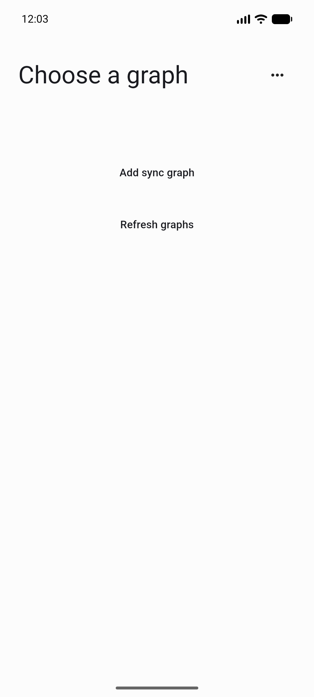

### ISSUE-003: Settings opens as a blank modal scrim

| Field | Value |
|-------|-------|
| Severity | high |
| Category | functional / visual / UX |
| View | Graph picker → overflow → Settings |
| Repro Video | N/A; deterministic layout failure |
| Status | Fixed and verified by E2E on emulator |

**Description**

Opening Settings pushed a modal route but rendered only its gray scrim. Flutter
reported a flex child under unbounded width constraints: the shared iOS-style
language radio picker placed every language in one row, while the Theme and
Language selects themselves had no finite Material form width.

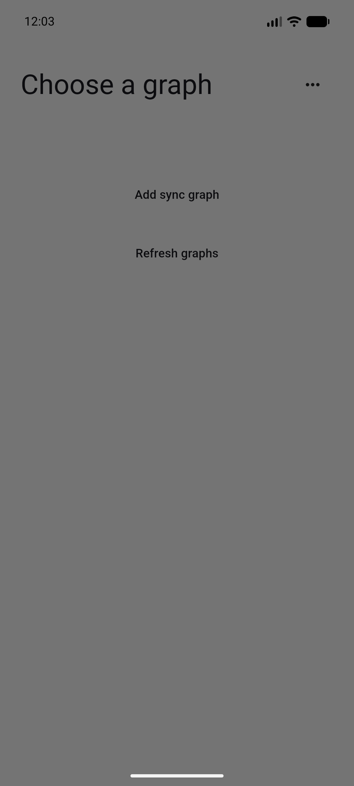

**Fix Verification**

Android now uses a bounded Material select and dropdown for language while iOS
keeps its native radio-group Picker. Both Theme and Language controls have
finite form widths. LG tests pass 125/125, and Maestro verified Settings,
language selection, Tabs, runtime log, back navigation, and dismissal.

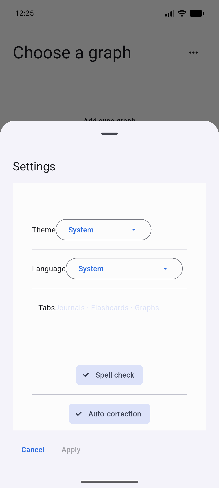

### ISSUE-004: Autocomplete can submit a candidate from the previous query

| Field | Value |
|-------|-------|
| Severity | medium |
| Category | functional / UX / race condition |
| View | Journal Outliner → inline editor → tag autocomplete |
| Repro Video | N/A; captured by the repeatable Maestro sequence |
| Status | Fixed and verified on emulator |

**Description**

Typing `#` published the initial candidate list, then typing `E2E Pro` queued
several core-backed text updates. A fast tap could still select row zero from
the old `#` result before the refreshed query arrived. The selected tag was
therefore timing-dependent even though every individual effect succeeded.

Expected: candidates from an older editor value disappear immediately, and a
candidate event cannot overtake pending or in-flight text changes.

**Repro Steps**

1. Open **E2E Journal 08** and edit **E2E Journal Block 08**.
2. Enter `#`, then immediately enter `E2E Pro`.
3. Tap the first candidate before the last text effect resolves.
4. Hide the keyboard and observe that the expected `#E2E Project` chip is
   intermittently missing.

The failed run is retained in
`~/.maestro/tests/2026-09-01_094845/android-node-tag-navigation/`.

**Fix Verification**

LG now removes candidates produced for the previous query as soon as editor
text changes and rejects autocomplete selection while that block has a queued
or in-flight text update. Two reducer regressions cover pending and in-flight
ordering. The Android E2E waits for and selects the actual **E2E Project** row.
The node/tag flow and the other nine signed-in Android modules pass in sequence;
LG passes 137 tests and Flutter passes 68 tests.

### ISSUE-005: Authentication content is centered inside a narrow retained layer

| Field | Value |
|-------|-------|
| Severity | medium |
| Category | visual / responsive layout |
| View | Signed-out authentication |
| Repro Video | N/A; deterministic static layout failure |
| Status | Fixed and verified on emulator |

**Description**

The Flutter root `Stack` gives non-positioned children loose horizontal
constraints. The authentication column used `grow`, which filled the vertical
Flex axis, but retained its intrinsic 780-pixel width on a 1080-pixel emulator.
The sign-in content therefore appeared left of the physical screen center.

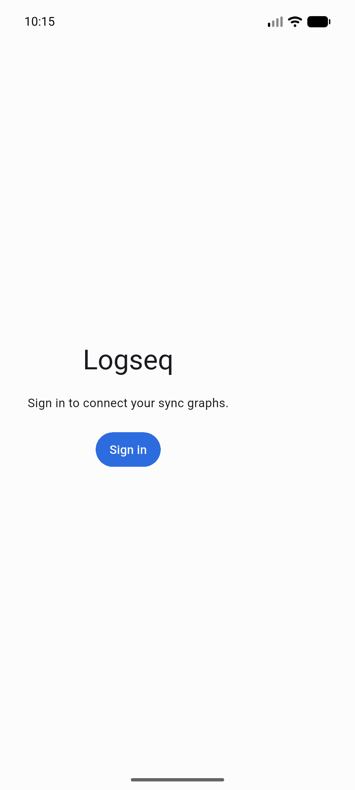

**Fix Verification**

The Flutter authentication surface now stretches to the available width before
an inner column centers its content. UIAutomator reports
`screen.authentication` at `[0,132][1080,2337]`, and the signed-out Maestro
flow passes against the actionable sign-in control.

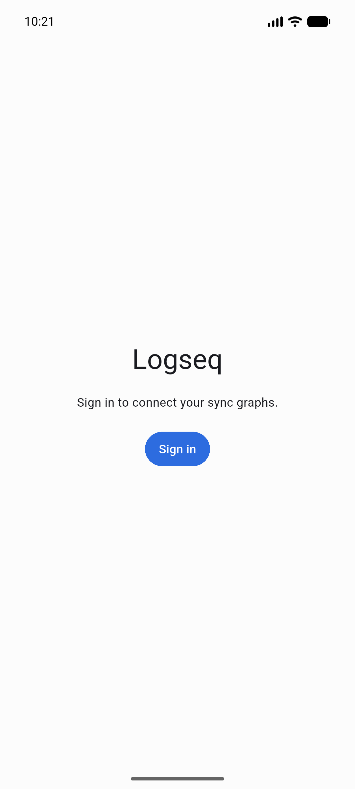

### ISSUE-006: Semantic secondary text is transparent throughout Android

| Field | Value |
|-------|-------|
| Severity | high |
| Category | visual / accessibility / content |
| View | Every view using `muted-foreground`; first confirmed on Graph picker |
| Repro Video | N/A; deterministic theme-token failure |
| Status | Fixed in LUI and verified on a physical device |

**Description**

LG correctly emitted the cross-platform `muted-foreground` token, but the LUI
Flutter backend did not map it into the Material `ColorScheme`. Unknown tokens
fell back to `Colors.transparent`. Supporting text, captions, statuses, and
form guidance remained in the accessibility tree while becoming invisible.

**Fix Verification**

LUI now maps `muted-foreground` to Material 3 `onSurfaceVariant`. The fix and a
backend regression test are pushed as commit
`09631149799f358f55fb6fc13bfa73dfb07e9cf2`; the app pins only its Flutter
backend to that compatible revision. All 74 tests on that LUI revision pass,
the Logseq Chat Flutter suite passes 68 tests, and physical-device screenshots
show both page guidance and empty-state descriptions at the expected secondary
contrast.

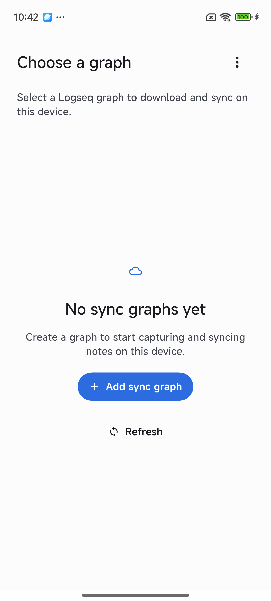

### ISSUE-007: Empty Graph picker has oversized hierarchy and floating text actions

| Field | Value |
|-------|-------|
| Severity | medium |
| Category | visual / UX / empty state |
| View | Graph picker with no sync graphs |
| Repro Video | N/A; deterministic empty state |
| Status | Fixed and verified on a physical device |

**Description**

The title used the default oversized heading, while **Add sync graph** and
**Refresh graphs** were ungrouped ghost text buttons floating near the top of
an otherwise empty page. There was no empty-state icon, explanation, or clear
primary action.

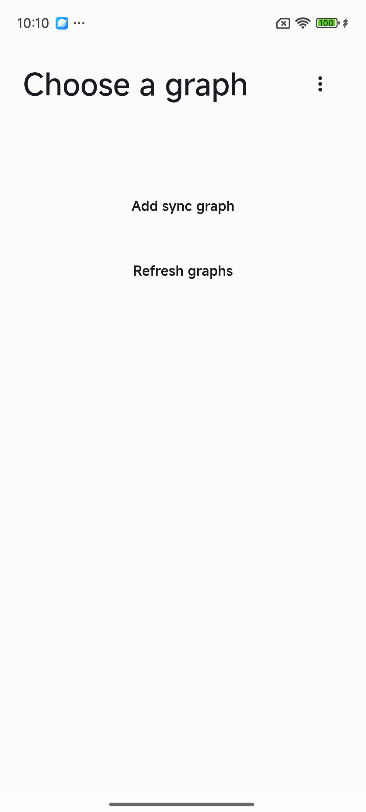

**Fix Verification**

Android now uses a compact level-three page title and a centered Material empty
state with a cloud icon, secondary explanation, filled Add action, and a
lower-emphasis Refresh action. iOS retains its existing main-branch layout.
A Flutter-profile LG regression pins the title level, full-width layout,
empty-state presence, action priority, and Material icon names.

### ISSUE-008: Authentication brand name does not match the installed app

| Field | Value |
|-------|-------|
| Severity | medium |
| Category | visual / product identity / regression |
| View | Signed-out authentication and Android launcher |
| Repro Video | N/A; deterministic text mismatch |
| Status | Fixed and verified on emulator and physical device |

**Description**

The Android manifest and launcher identified the package as **Logseq Chat**, but
the shared authentication surface still rendered the old **Logseq** name. This
made the new app difficult to distinguish from an existing Logseq installation.

**Fix Verification**

Both Flutter and Apple LG profiles now render **Logseq Chat** from the shared
authentication view. A cross-host LG regression rejects the old standalone
name. Android also uses the full product name for clipboard content and the
system share chooser. The signed-out Maestro flow asserts the product name
against the rebuilt native library. The rebuilt debug APK is installed on both
the emulator and physical device.

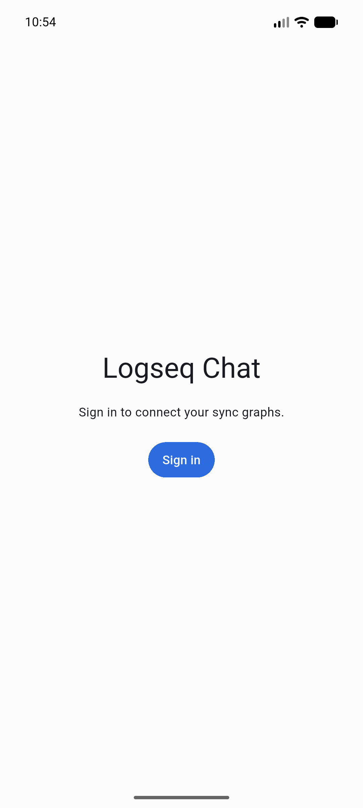

### ISSUE-009: Adaptive launcher foreground is cramped under OEM masks

| Field | Value |
|-------|-------|
| Severity | medium |
| Category | visual / branding / Android adaptive icon |
| View | MIUI launcher; also applicable to Pixel and themed icons |
| Repro Video | N/A; verified with same-position physical-device screenshots |
| Status | Fixed and verified on a physical device |

**Description**

The sun foreground occupied the full 66-unit adaptive-icon safe diameter. MIUI
applied additional foreground scaling, leaving the outer rays visually cramped
against the rounded-square mask. Other OEM launchers are allowed to apply
different masks and motion, so using the entire nominal safe diameter was too
fragile.

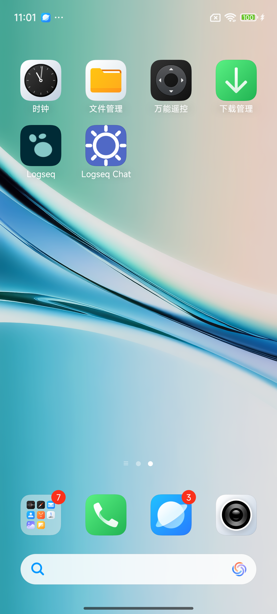

**Fix Verification**

The foreground and monochrome vectors now scale around the 108-unit viewport
center with an additional 14% inset. The monochrome asset uses an opaque black
mask so Android 13+ can apply wallpaper-derived themed colors correctly. A
Flutter resource regression keeps the canonical Android and Flutter-host assets
identical and pins their pivot, scale, and monochrome semantics.

### ISSUE-010: Audio action opens a file picker instead of recording

| Field | Value |
|-------|-------|
| Severity | high |
| Category | functional / parity / Android platform integration |
| View | Outliner editor → Audio recording |
| Repro Video | N/A; verified from command routing and missing platform permission |
| Status | Fixed in code; physical-device verification pending OEM install approval |

**Description**

The Android Audio recording command was routed to `ACTION_OPEN_DOCUMENT` and
the Flutter manifest did not request `RECORD_AUDIO`. Android therefore could
only pick an existing audio file, while iOS recorded, inserted, and played a
new voice note inline.

**Fix Verification**

Android now records AAC audio through `MediaRecorder`, requests microphone
permission at runtime, writes the result into the graph asset metadata path,
hashes it with SHA-256, and inserts it through the authoritative core
`addAsset` action. Audio assets render as a Material inline player backed by
Android `MediaPlayer`, with play, pause, progress, error recovery, and lifecycle
cleanup. Flutter passes 86 tests, Kotlin unit tests and debug APK compilation
pass. The dedicated physical-device instrumentation APK was blocked before
execution by MIUI's USB installation confirmation (`INSTALL_FAILED_USER_RESTRICTED`),
so the report does not claim a hardware recording pass yet.

### ISSUE-011: Rich media renders as placeholders instead of native content

| Field | Value |
|-------|-------|
| Severity | high |
| Category | functional / parity / rich content |
| View | Journal and page outliner rich blocks |
| Repro Video | N/A; deterministic Flutter renderer behavior |
| Status | Fixed and verified on emulator |

**Description**

Flutter rendered video and iframe nodes as a play icon plus their raw URL,
rendered math as italic TeX source, and rendered cloze text as an always-visible
static chip. The nodes had parity identifiers but not iOS-equivalent behavior.

**Fix Verification**

YouTube and iframe content now use a lightweight Material preview and create a
system WebView only after an explicit tap, preserving lazy-list scrolling.
YouTube URLs are normalized to `youtube-nocookie.com`, unsafe schemes are
rejected, and timestamp blocks update the embed start time. LaTeX is typeset
with a pure Flutter renderer and malformed expressions retain a readable
fallback. Cloze content now reveals and hides through a Material action chip.
Code blocks use selectable, horizontally scrollable syntax-highlighted text
with light and dark Material color palettes; parsed syntax trees are cached so
lazy-list rebuilds do not repeat highlighting work. Unit and widget regressions
cover URL safety, deferred platform-view creation, timestamp parity, math
fallback, cloze interaction, syntax highlighting, and accessibility. The
Android YouTube Maestro flow requires a loaded platform-view identifier rather
than accepting a placeholder.

### ISSUE-012: Android block rows cannot be dragged between positions

| Field | Value |
|-------|-------|
| Severity | medium |
| Category | functional / interaction / outliner |
| View | Journal and page outliner |
| Repro Video | N/A; deterministic missing drag target |
| Status | Fixed in code and widget integration test |

**Description**

A long press emitted the selection/drag-start event, but Flutter rows were not
draggable and did not accept drops. The core supported before, inside, and
after placement, while the Android surface could never publish one.

**Fix Verification**

Visible lazy-list rows now use `LongPressDraggable` and `DragTarget`. Drop zones
match iOS at the top 25%, middle 50%, and bottom 25%. Drag feedback is a small
Material title card so video, audio, and WebView children are never duplicated.
A widget integration test performs a real long press, moves one block over a
second block, and verifies the LG extension receives the target UUID and
`inside` placement.

### ISSUE-013: Idle Android outliner edits are never committed

| Field | Value |
|-------|-------|
| Severity | high |
| Category | functional / durability / parity |
| View | Every journal and page outliner editor |
| Repro Video | N/A; deterministic host-runtime omission |
| Status | Fixed in code and automated tests; device E2E pending installation |

**Description**

iOS schedules the authoritative core `saveEditing` event one second after text
changes settle. The Flutter Android effect drain did not recognize or schedule
that action, so an edit could remain in the transient editor state indefinitely
unless a later structural action happened to commit it.

**Fix Verification**

The Android effect drain now mirrors the iOS debounce policy: text changes and
autocomplete completion schedule one save, newer outliner mutations cancel the
older timer, and visible autocomplete prevents premature saving. The core
executor maps the synthetic effect to `outlinerEvent/saveEditing`. Focused tests
cover request encoding, successful autosave, and autocomplete suppression.

### ISSUE-014: Android Runtime log always appears empty

| Field | Value |
|-------|-------|
| Severity | medium |
| Category | functional / diagnostics / settings |
| View | Settings → Check log |
| Repro Video | N/A; native service returned a literal empty array |
| Status | Fixed and verified on emulator |

**Description**

Android returned `[]` for every runtime-log request. The Settings screen and its
filters were present, but UI/Core diagnostics, ordering, error filtering, and
copying had no real records behind them.

**Fix Verification**

Android now owns a thread-safe 500-record ring buffer with the same source,
level, filter, ordering, timestamp, and JSON semantics as iOS. Host startup,
core restoration, failures, and attachment imports append records without
reading privileged global logcat data. Kotlin tests cover bounds, filtering,
ordering, and JSON escaping. Android Settings E2E now requires visible `INFO`
records for both UI and Core sources. On the rebuilt emulator app, **Check
log** displayed real Android host, Flutter host, and core-effect records;
level, order, and source controls updated immediately, Copy and Refresh
dispatched without an error, and Done returned to Settings.

### ISSUE-015: Selected Android attachments are discarded

| Field | Value |
|-------|-------|
| Severity | high |
| Category | functional / assets / parity |
| View | Composer and outliner attachment actions |
| Repro Video | N/A; deterministic missing activity-result handling |
| Status | Fixed in code and automated tests; device E2E pending installation |

**Description**

The Flutter Android host launched the system document or camera intent but did
not receive its result. Selected files therefore never entered app storage or
the authoritative core asset model.

**Fix Verification**

The host now receives multi-document and full-resolution camera results, copies
them into `Assets`, computes SHA-256 and size metadata off the UI thread, and
dispatches `addAsset` with the originating target block when applicable.
Relative paths resolve consistently with iOS. Structured Logcat and in-app
runtime records cover launch, result, import, and core insertion stages.

### ISSUE-016: Graph catalog only refreshes after a manual action

| Field | Value |
|-------|-------|
| Severity | medium |
| Category | functional / UX / stale state |
| View | Signed-in app → Graphs |
| Repro Video | N/A; verified with lifecycle and effect logs |
| Status | Fixed and verified on emulator |

**Description**

Restoring a signed-in session loaded the saved catalog once, but graph creation
and preparation state could change while Android remained in the foreground.
The visible list stayed stale until the user explicitly tapped **Refresh**.

**Fix Verification**

The Flutter host now starts a coalescing foreground refresh loop after session
restore, stops it in the background and on sign-out, and immediately refreshes
again on resume. Device logging exposed that the first implementation sent the
selected-graph `refresh` action, so restore and resume both ended in
`automatic refresh.rejected` and never applied the catalog. The automatic path
now sends the catalog-specific `refreshGraphCatalog` action and logs the core
error code/message for any rejected response. On the rebuilt emulator app,
restore completed at 18:54:15 and the next 15-second periodic refresh completed
again at 18:54:29. Five focused tests cover the request contract, diagnostic
rejection, overlap, periodic scheduling, and timer cancellation.

### ISSUE-017: Graphs long list overflows instead of scrolling

| Field | Value |
|-------|-------|
| Severity | high |
| Category | visual / functional / UX |
| View | Graphs with a full remote catalog |
| Repro Video | N/A; deterministic full-state layout failure |
| Status | Fixed and verified on emulator |

**Description**

LUI Flutter rendered the semantic `list` primitive as an eager `Column`. A
real catalog overflowed the viewport by 2296 pixels, displayed Flutter's
yellow/black failure stripe, and made the remaining graphs unreachable.

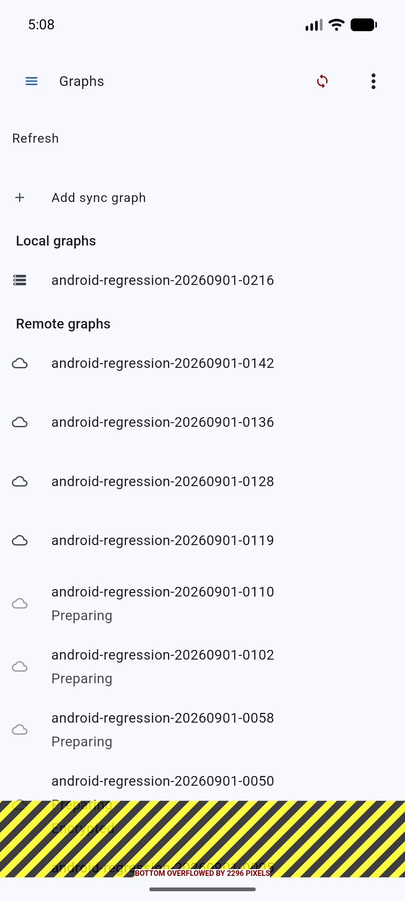

**Fix Verification**

Flutter now maps `list` to a native lazy `ListView`, matching SwiftUI's native
`List` semantics without changing the Apple backend. The full page scrolls,
starts at the Refresh action, and logs no RenderFlex error. The LUI fix is
pushed as commit `9512238e40248f664d7a870565360436818410ac`; all 77 LUI tests
and all 112 Logseq Chat Flutter tests pass.

### ISSUE-018: Graphs actions have debug-page hierarchy

| Field | Value |
|-------|-------|
| Severity | medium |
| Category | visual / UX / Android design |
| View | Graphs |
| Repro Video | N/A; deterministic static layout issue |
| Status | Fixed and verified on emulator |

**Description**

**Refresh** is an unadorned full-width text row and **Add sync graph** is only
slightly more identifiable because it has a plus icon. The two primary page
actions consume large vertical bands without a clear priority, while section
headings and graph rows begin below them with no cohesive Material grouping.

Expected: compact Material actions with one unmistakable primary create action,
a lower-emphasis refresh action, consistent icons, and clear catalog sections.

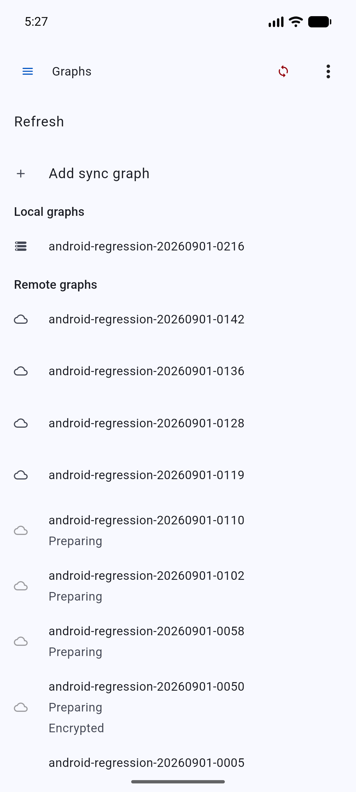

**Fix Verification**

Android now renders one 16dp-inset, 12dp-gap action row. **Add graph** is a
filled primary Material button, **Refresh** is a tonal secondary button, both
are equal width with native icons and 48dp touch targets, and the catalog
continues below as a lazy native list. The implementation is Flutter-only;
SwiftUI retains the main-branch native List rows. LG passes 144 tests and
Flutter passes 112 tests. Emulator event logs prove Refresh reaches
`refresh-graphs` and succeeds, while Add graph opens and dismisses the existing
Material form sheet.

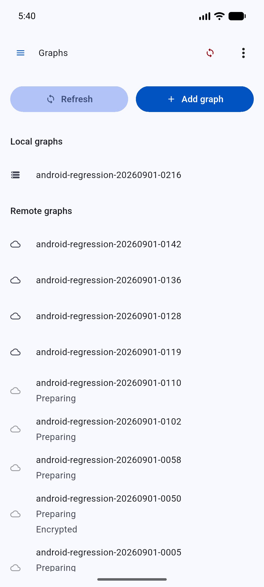

### ISSUE-019: Journals loses every bottom action on a populated graph

| Field | Value |
|-------|-------|
| Severity | high |
| Category | functional / layout / UX |
| View | Journals with enough rows to occupy the viewport |
| Repro Video | N/A; deterministic across navigation and app relaunch |
| Status | Fixed and verified on emulator |

**Description**

The journal rows render, but the entire mutually-exclusive bottom chrome is
absent: there is no Capture/Search dock, expanded composer, editor toolbar, or
selection toolbar. Android Back exits directly to the launcher, proving this is
not a hidden editing or selection state. Returning to the app reproduces the
same root screen, leaving no way to capture or search.

Expected: the active bottom chrome remains anchored above the navigation bar
while the journal list independently consumes and scrolls within the remaining
height.

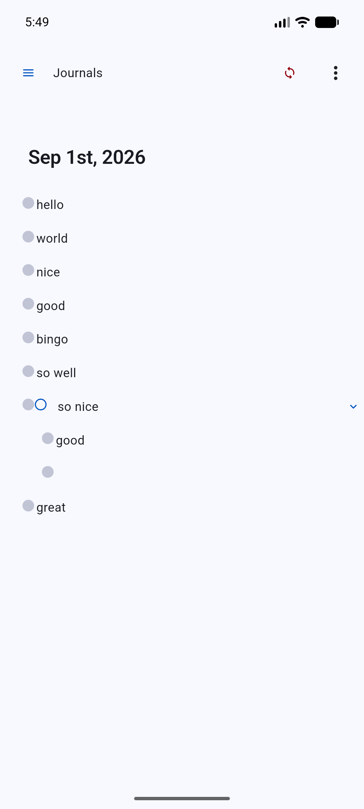

**Root Cause**

The Flutter-only Capture/Search row incorrectly declared `grow: 1` inside the
bottom stack. LUI correctly translated that value to an `Expanded`, but the
bottom stack is measured with unbounded intrinsic height. Flutter therefore
could not lay out the flex child, which removed the complete mutually-exclusive
bottom chrome from the rendered surface.

**Fix Verification**

Android now keeps the Capture/Search row at intrinsic height; its Capture child
still grows horizontally, so the primary action fills the available width
without consuming vertical space. Two LG regressions pin that Android-specific
contract, while the separate SwiftUI assertion retains the existing iOS grow
behavior. All 144 LG tests pass. A freshly rebuilt debug APK was installed on
the emulator with the populated graph preserved: Capture/Search remained
anchored above the navigation bar, Capture expanded and dismissed through the
native Back flow, Search opened its Material full-screen presentation, and no
Flutter, RenderFlex, or overflow exception was logged.

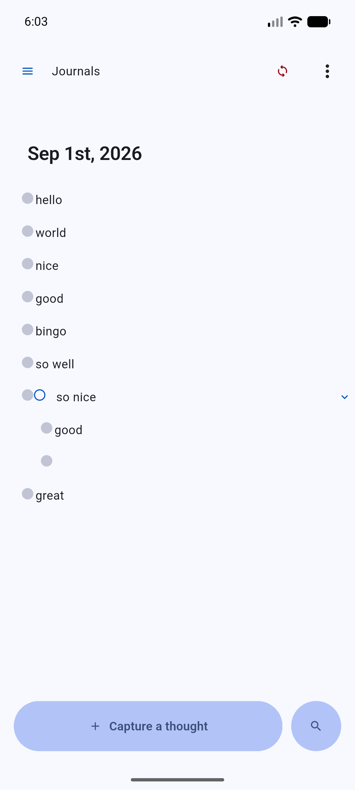

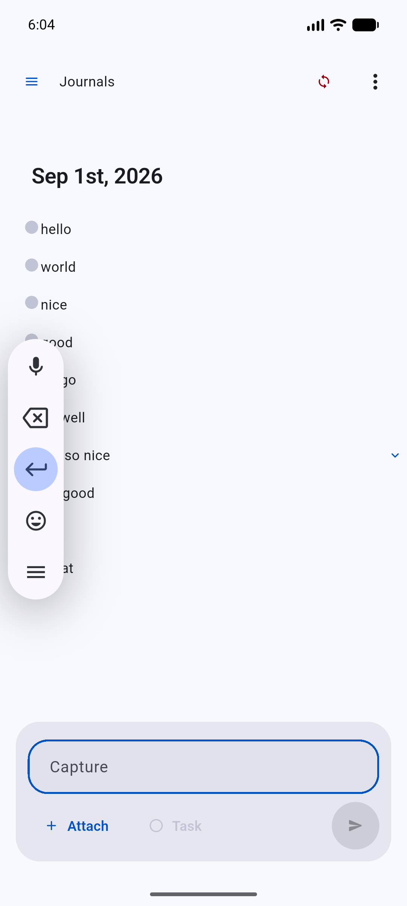

### ISSUE-020: Settings form has unlabeled duplicate selects and weak Material hierarchy

| Field | Value |
|-------|-------|
| Severity | medium |
| Category | visual / UX / accessibility |
| View | Settings → General |
| Repro Video | N/A; deterministic static layout issue |
| Status | Fixed and verified on emulator |

**Description**

The General settings sheet renders two outlined selects that both display
`System`, but neither has a visible field label, so Appearance and Language are
indistinguishable. The form is wrapped in a large white rectangle against an
almost-white sheet, the Tabs summary uses disabled-looking low-contrast blue,
and Cancel/Apply appear as loose text actions at the lower left instead of a
clear Material action area. Large gaps make the settings feel unfinished and
hard to scan.

Expected: a compact Material settings form with persistent Appearance and
Language labels, grouped editor switches and navigation rows, accessible
secondary text, and an anchored Cancel/Apply action hierarchy.

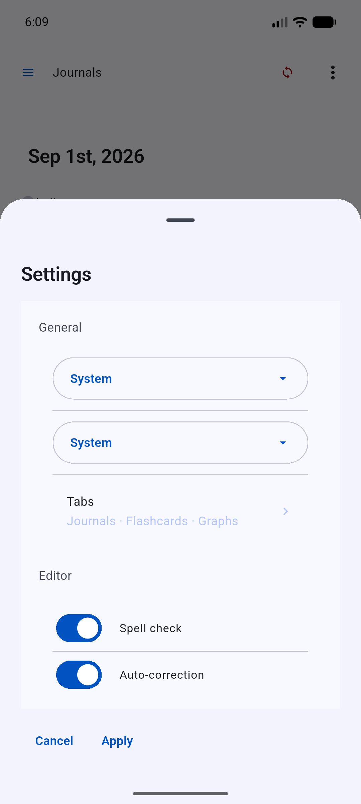

**Root Cause**

LUI's `select` authoring element discarded `:label`, and all three validation
boundaries independently rejected `AccessibilityLabel` on a Select. Flutter
therefore had no field name to render, while adding the property only in the app
caused the retained LG runtime to reject the complete Settings tree.

**Fix Verification**

LUI now retains the select label in the closed protocol. Flutter renders it as
a persistent Material `InputDecorator` label; the Apple backend accepts the
same accessibility metadata without changing its visual SwiftUI picker. The
Android form uses tonal cards, readable supporting text, native switches, and
an anchored equal-width secondary/primary action row. LUI passes 201 tests,
Logseq Chat LG passes 144 tests, Flutter passes 112 tests, and the rebuilt debug
app renders Theme and Language distinctly with no protocol or layout error.

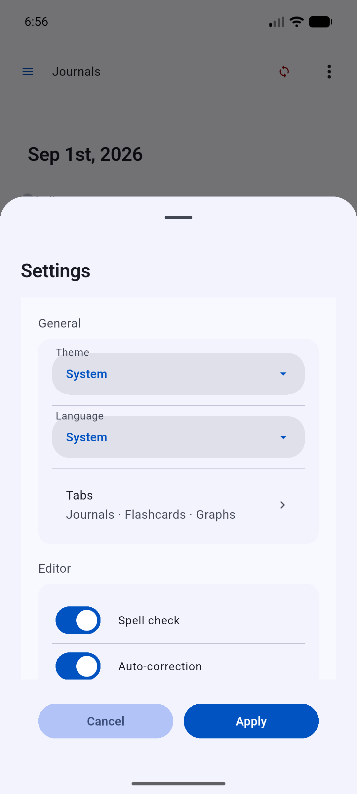

### ISSUE-021: Runtime log sheet overlaps navigation actions and filters

| Field | Value |
|-------|-------|
| Severity | medium |
| Category | visual / functional / UX |
| View | Settings → Check log |
| Repro Video | N/A; deterministic static layout failure |
| Status | Fixed and verified on emulator |

**Description**

The sheet-level **Refresh** and **Done** actions occupy the same vertical band
as the runtime screen's **Errors only** and **Newest first** filters. Labels
and hit targets visibly overlap, so the first filter row is hard to understand
and unreliable to operate. The log body itself is populated, proving this is a
layout composition problem rather than the earlier missing-log-data problem.

Expected: one Material hierarchy with navigation/actions in a non-overlapping
header or footer, compact filter controls below it, and the log list consuming
the remaining scrollable area.

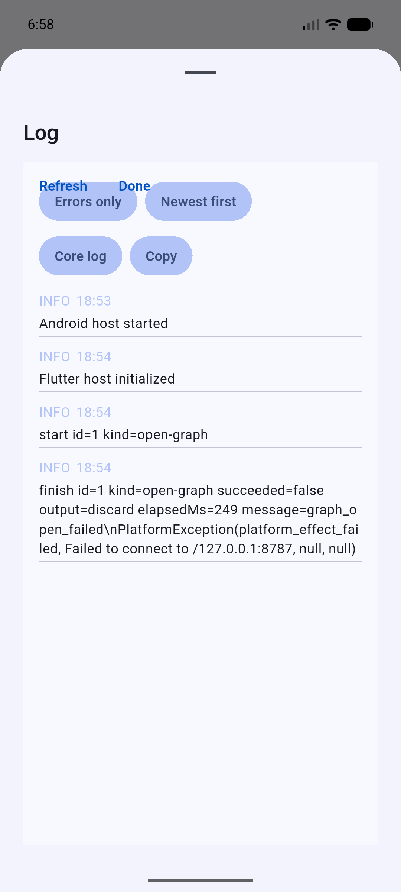

**Root Cause**

The shared sheet exposed the Runtime log screen and its navigation toolbar as
two sibling children. Flutter bottom sheets compose their single content slot
as an overlay, so the navigation toolbar was painted over the screen's first
filter toolbar. SwiftUI's native sheet backend handles those navigation
children separately and did not exhibit the problem.

**Fix Verification**

Flutter now receives one bounded vertical sheet child. The Runtime log screen
owns the flexible region, while an equal-width secondary **Refresh** and
primary **Done** row is anchored below it. SwiftUI retains the existing native
navigation toolbar path. The new RED test first proved the old multi-child,
overlay-toolbar contract, then passed after the layout change; all 144 LG and
112 Flutter tests remain green. On the rebuilt emulator, every filter was
independently tappable, Copy and Refresh dispatched, and Done returned to the
Settings sheet.

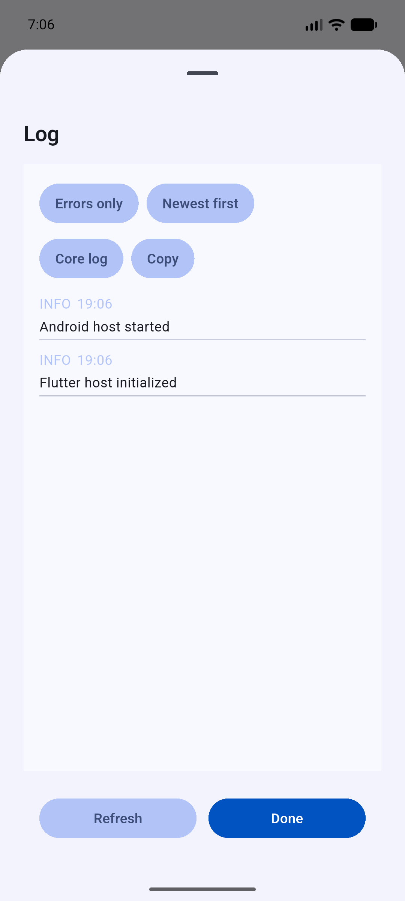

### ISSUE-022: Settings Tabs row receives the tap but never navigates

| Field | Value |
|-------|-------|
| Severity | medium |
| Category | functional / navigation / settings |
| View | Settings → General → Tabs |
| Repro Video | [issue-022-tabs-does-not-open.mp4](android-dogfood/videos/issue-022-tabs-does-not-open.mp4) |
| Status | Fixed and verified on emulator |

**Description**

Tapping the full-width **Tabs** row leaves the main Settings sheet unchanged.
The Flutter event log records the row's Press event every time, so this is not
a missing hit target or Maestro selector failure; the navigation action is
lost after it reaches the LG bridge. The user therefore cannot configure tab
visibility or ordering on Android.

Expected: the Settings sheet immediately replaces its main content with the
Tabs configuration screen, with a clear path back to Settings.

**Repro Steps**

1. Open Settings and keep the General card visible.
2. Tap the full-width **Tabs** row.
3. Observe that the row emits a Press event but the sheet remains on Settings.

**Root Cause**

The Press action correctly set `settings-tabs-open`. Rendering the destination
then created Flutter icon-only tab-reordering buttons whose authoring maps used
`accessibility-label`; LUI buttons expose that semantic through `label`.
Because the required label was absent from the retained protocol, the backend
rejected the entire destination patch and left the previous Settings tree on
screen.

**Fix Verification**

The reordering controls now publish valid button labels. A new regression test
dispatches Press through the rendered Flutter row and verifies that Tabs
replaces the main Settings screen, covering the real path rather than directly
sending a model action. All 145 LG tests and 112 Flutter tests pass. The rebuilt
debug APK entered `screen.settings.tabs` during Android Settings E2E.

### ISSUE-023: Tabs sheet overlaps its back action and misaligns every row

| Field | Value |
|-------|-------|
| Severity | medium |
| Category | visual / layout / Android design |
| View | Settings → Tabs |
| Repro Video | N/A; deterministic static layout failure |
| Status | Fixed and verified on emulator |

**Description**

After navigation succeeds, the Flutter sheet paints the **Settings** back
action over the large **Visible tabs** heading. The tab rows float around the
horizontal center instead of forming full-width Material settings rows, with
large irregular gaps between labels, selection state, and reorder arrows.
The result is visually broken and also hides the child toggle semantics that
the Settings E2E expects.

Expected: one bounded sheet layout with a non-overlapping navigation/action
area, full-width compact tab rows, stable semantics, and native Android touch
targets.

Evidence: Android Settings E2E artifact
`~/.maestro/tests/2026-09-01_192731/android-settings/screenshots/step-037-assertCondition-toggle.settings.tab.jour.png`.

**Fix Verification**

Flutter now receives one bounded vertical sheet child: a growing Tabs screen
and a separate full-width **Back to Settings** footer. The Android-only screen
uses a compact heading, a native lazy list, 56dp tonal rows, leading tab state,
and trailing reorder controls with stable labels and identifiers. The shared
SwiftUI branch retains its native List and navigation toolbar. The real-Press
LG regression covers layout, navigation, accessibility validation, and leading
alignment; all 145 LG tests pass. The rebuilt debug APK completed the full
Settings E2E, including toggling Flashcards off/on, returning to Settings, and
the Runtime log flow. Final screenshot artifact:
`~/.maestro/tests/2026-09-01_195644/android-settings/takeScreenshot/android-settings-material-icons.png`.

### ISSUE-024: Search returns data but renders an empty results surface

| Field | Value |
|-------|-------|
| Severity | medium |
| Category | functional / layout / search |
| View | Journals → Search |
| Repro Video | N/A; covered by the repeatable Capture/Search E2E flow |
| Status | Fixed and verified on emulator |

**Description**

Capturing a task succeeds and the new block appears in Journals, but searching
for its exact title shows a blank surface. The search field contains the full
query and no error is visible, leaving the user unable to open valid results.

Expected: matching pages and blocks appear immediately below the Material
SearchBar and remain navigable through the native Android back stack.

**Root Cause**

Targeted effect logging proved that every query update reached the LG bridge,
the `search-nodes` effect executed successfully, and the final core response
contained three results. The result `list` was nested in a growing vertical
search surface without its own `grow` constraint. Flutter therefore laid out
the populated list at zero height. SwiftUI's native `List` expands by default,
which is why the shared view had not exposed the same failure on iOS.

**Fix Verification**

The result list now fills the remaining search surface with `grow 1.0`. A new
layout-contract regression first failed against the zero-height list and now
passes. Diagnostic traces report only query length and result count, never
query or result text. The rebuilt debug APK completed the full Capture/Search
E2E: create task, search exact title, open result, verify node, navigate back to
Search, return to Journals, and find the captured task.

### ISSUE-025: Periodic graph refresh blocks editor input and triggers ANR

| Field | Value |
|-------|-------|
| Severity | high |
| Category | performance / functional / concurrency |
| View | Journals composer while automatic graph refresh runs |
| Repro Video | N/A; Android system ANR captured during Composer E2E |
| Status | Fixed and verified on emulator |

**Description**

Rapid composer edits overlap the 15-second automatic graph refresh. Input is
dropped or delayed and Android can show **Logseq Chat isn't responding**.

**Root Cause**

The Android ANR trace showed a background Dart worker inside
`refreshGraphCatalog → snapshot_visible → graph_sidebar_pages → SQLite` while
the foreground input dispatch timed out after five seconds. Core calls run on a
worker isolate, but core and LG share the same OCaml runtime lock. Building a
complete graph snapshot for a catalog-only refresh therefore blocked the UI
isolate when it tried to dispatch composer events into LG.

**Fix Verification**

`refreshGraphCatalog` now returns a dedicated lightweight graph-catalog patch
containing only graph metadata. LG applies only those owned fields and preserves
the active composer, journal rows, navigation, and editor state. Unchanged
catalogs are also skipped by the Flutter host. Automatic polling runs only while
the authenticated graph picker is foreground; opening a graph stops it so OCaml
network discovery cannot contend with editor input. Core, LG, and Flutter
regressions cover patch identity, editor-state preservation, polling policy,
unchanged-catalog skipping, and changed-catalog application.
The rebuilt APK then completed the full Composer lifecycle E2E without another
ANR: clear draft, type, collapse, restart, restore exact draft, clear it again,
and return to the collapsed composer.

### ISSUE-026: Node destinations have no visible Android back action

| Field | Value |
|-------|-------|
| Severity | medium |
| Category | functional / navigation / Android design |
| View | Journals → journal or page detail |
| Repro Video | N/A; covered by the repeatable Material Navigation E2E flow |
| Status | Fixed and verified on emulator |

**Description**

Opening a journal or page replaced the root content and title, but the Material
top app bar had no visible back affordance. Android system back still worked,
yet users navigating by touch had no discoverable way to return.

Expected: every non-root destination exposes a 48dp Material back action with
stable automation and TalkBack semantics, while iOS continues using its native
NavigationStack back button.

**Fix Verification**

The Flutter header now switches its leading action from the sidebar menu to an
`arrow_back` action whenever the LG app-navigation depth is non-zero. The
button uses `button.navigation.back`, has the accessibility label **Back**, and
pops exactly one LG route. The host check keeps the shared SwiftUI renderer
unchanged. The new regression failed before the control existed and now passes;
all 146 LG tests, focused Flutter extension/icon tests, Flutter analysis, and
the complete Android Material Navigation E2E pass on the rebuilt APK.

### ISSUE-027: Core restore contends with LG and causes restart ANR

| Field | Value |
|-------|-------|
| Severity | high |
| Category | performance / concurrency / startup |
| View | App restart with a persisted local graph |
| Repro Video | N/A; Android system ANR and repeatable restart flow captured |
| Status | Fixed and verified on emulator |

**Description**

Refreshing the app could render Journals and then stop accepting input until
Android displayed **Logseq Chat isn't responding**. The failure remained even
after catalog polling was disabled for an open graph.

**Root Cause**

The 22:14 Android ANR shows the Dart/UI thread blocked in
`pthread_mutex_lock`, while Dart workers were executing the same
`liblogseq_chat_core.so`. Core and LG share one OCaml runtime lock, but the
Flutter bridge allowed background Core FFI and foreground LG FFI to enter it
concurrently. Startup `appear`, accessibility, or input dispatch therefore
waited on long graph restore work. The platform log recorded 398 and 169
skipped frames and a 5.083-second focus-event timeout.

**Fix Verification**

A native-runtime scheduler now serializes all Core requests. While Core owns
the runtime, LG UI calls are queued on the Dart side instead of blocking the UI
thread; they flush in order when Core becomes idle, then effect draining
resumes. Three focused scheduler tests cover lock ownership, Core ordering, UI
ordering, and idle notification. Effect/extension tests and Flutter analysis
pass. The rebuilt APK completed three consecutive forced restarts with sidebar
interaction each time, and Android DropBox contains no ANR newer than the
pre-fix 22:14 record.

### ISSUE-028: Outliner bullet and task status markers do not match iOS

| Field | Value |
|-------|-------|
| Severity | medium |
| Category | visual / interaction hierarchy / cross-platform parity |
| View | Journals and node outliner rows |
| Repro Screenshot | `ui-comparison/android/journals.png` |
| Status | Fixed and verified on emulator |

**Description**

Android rendered the ordinary block bullet from a full Material circle glyph,
making it much larger and heavier than iOS. Task rows then added a second
generic 16dp status icon beside it. The two independent controls looked
crowded, and status colors from the shared `task-*` palette were unsupported by
the Flutter backend and could resolve to transparent. The status context menu
also required a long press, and its standard `accent` foreground token rendered
its labels and icons transparent.

Expected: preserve iOS main's separate interaction semantics—bullet zooms into
the block and task status changes status—while matching its 7pt bullet, 22pt
status glyph, and 24pt alignment slots.

**Fix Verification**

Flutter now paints a dedicated centered 7dp bullet behind the existing zoom
target and a centered 22dp task glyph behind the existing status target. Task
states use the same row foreground as iOS, and retained rows reactively swap
the icon without introducing Android-only status colors. SwiftUI continues
through its original icon/button path. LUI Flutter now opens menu-only buttons on primary
tap and maps the shared `accent` and `destructive` tokens to Material primary
and error roles. The 147-test LG suite covers marker geometry and retained-row
updates; LUI's 79 Flutter tests cover menu activation and semantic colors. A
rebuilt debug APK was installed on the emulator, where primary tap opened the
visible native menu and selecting Done immediately produced the full-ring check
glyph and completed text treatment. A follow-up icon-source comparison found
that Android still used materially different silhouettes for backlog, doing,
review, and done (ellipsis, calendar, rectangular comment, and broken-ring
check). Those now use the closest native Material equivalents to iOS's dashed
circle/progress ring/comment-check/full-ring check semantics. The complete
121-test Flutter suite and `flutter analyze` pass, and the rebuilt debug APK
shows the Done marker as a centered full-ring check without changing SwiftUI.

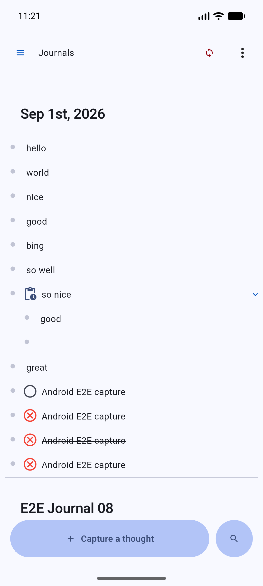

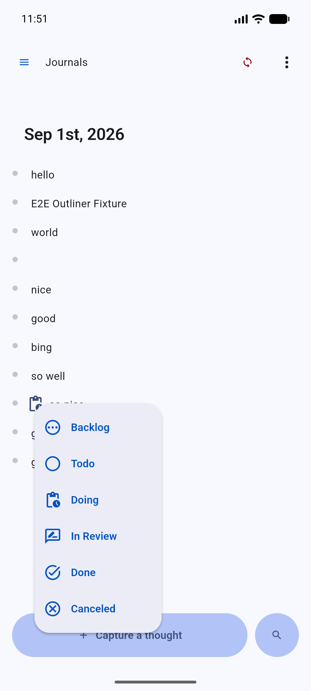

### ISSUE-029: Selection toolbar overflows and selected blocks have no state

| Field | Value |
|-------|-------|
| Severity | high |
| Area | Outliner / Selection / Android UI |
| Status | Fixed and verified on emulator |

**Description**

The shared selection toolbar supplied iOS's icon-plus-caption buttons with a
46pt fixed height. Flutter correctly rejected the unsupported top icon
placement, but the remaining Material button needed a 48dp minimum target and
rendered red vertical overflow warnings across every action. Plain Flutter
outliner rows also used a `box` to preserve editor gestures, so they could not
project the selected state that iOS shows immediately after a long press.

**Fix Verification**

Flutter now receives seven icon-only Material actions with stable accessibility
labels, 48dp targets, compact spacing, and horizontal scrolling retained for
narrow screens. SwiftUI keeps its existing captioned Liquid Glass toolbar.
LUI Flutter now supports `selected` on a generic box, exposes the state to
semantics, and paints the standard Material secondary-container selection
surface; the shared outliner projects its selected signal onto the existing
gesture-compatible row box. The dedicated visual Maestro flow confirms all
seven actions are visible with no overflow and the selected row is visibly
highlighted. LUI's 80 tests, the LG 148-test suite, the app's 121 Flutter tests,
and `flutter analyze` all pass.

### ISSUE-030: Flutter modal roots lose their accessibility identifiers

| Field | Value |
|-------|-------|
| Severity | high |
| Area | Dialogs / Sheets / Android E2E |
| Status | Fixed and verified on emulator |

**Description**

The Graphs screen loaded and refreshed correctly, but its Android E2E could
not address the visible delete confirmation dialog by
`dialog.graph-delete`. The same omission affected every Flutter dialog and
bottom-sheet root, making Settings and form workflows vulnerable to false
inaction reports and inaccessible automation.

**Root Cause**

LUI's modal controller built the real `DialogRoute` and
`ModalBottomSheetRoute` surface directly. That path bypassed the normal node
wrapper that applies `Semantics(identifier: ...)`, so only modal children kept
their identifiers. The invisible retained controller still had the identifier,
but the foreground surface exposed none to Android accessibility.

**Fix Verification**

LUI now applies the declared accessibility identifier to the actual dialog or
sheet surface. New widget tests cover both modal kinds and failed before the
fix. All 80 LUI Flutter tests, 121 application Flutter tests, and both analyze
gates pass. On the rebuilt APK, the Graphs E2E now long-presses the local graph
row using the native Android context-menu gesture, addresses the visible
delete dialog and its actions, cancels it, opens the Add graph sheet, verifies
its form controls, and returns to the catalog successfully.

### ISSUE-031: Rapid editor input sends redundant updates and autocomplete taps are lost

| Field | Value |
|-------|-------|
| Severity | high |
| Area | Outliner editor / Autocomplete / Android responsiveness |
| Status | Fixed and verified on emulator |

**Description**

Typing an autocomplete query quickly dispatched every intermediate value into
LG. Tapping a visible candidate while one of those updates was pending closed
the candidate toolbar but did not insert the selected tag.

**Root Cause**

The Flutter editor synchronously dispatched every intermediate text value into
LG, so a single keyboard burst repeatedly crossed the Dart/OCaml boundary on
the UI thread. LG then discarded `ChooseOutlinerAutocomplete` whenever a
text-change effect was pending or in flight. This avoided stale selection
state by throwing away the user's action instead of preserving its order.

**Fix Verification**

Flutter now coalesces an ordinary editor text burst for 80ms and publishes only
the latest title and caret, while newline and disposal cancel the pending
timer. LG queues the candidate-choice effect behind pending and in-flight text
changes instead of dropping it. The focused Flutter regression failed with
three immediate events before the change and now observes one latest event;
the LG regression failed because the choice was absent and now verifies exact
effect ordering. All 122 Flutter tests, Flutter analysis, and all 148 LG tests
pass. On the rebuilt APK, the complete node/tag E2E types `#E2E Pro`, selects
`E2E Project`, verifies the inserted tag chip and tagged-node navigation, and
finishes without an ANR.

The separately observed cold-start ANR was not caused by editor input. Android
reported `Application does not have a focused window` while the debug Flutter
process was still initializing and compiling JIT code on the emulator. Startup
phase logs now distinguish binding, first frame, platform-state load, bridge
load, LUI initialization, and root mounting so a future launch failure can be
classified from evidence instead of being attributed to the active editor.

### ISSUE-032: Android text sharing fails when the share title contains spaces

| Field | Value |
|-------|-------|
| Severity | medium |
| Area | Android E2E / Sharesheet entry |
| Status | Fixed and verified on emulator |

**Description**

The application handled a valid text share, but the E2E runner could not launch
the intent when its title was `Android share`. The local shell preserved the
quoted argument, then `adb shell` parsed the remote command a second time and
treated `share` as a separate package argument.

**Fix Verification**

The runner now escapes the title for the remote shell and has a focused runner
regression that checks the exact adb argument. The complete Android text-share
flow opens Capture, preserves the shared title and URL, and passes on the
emulator.

### ISSUE-033: Shared images are absent from the lazy journal and render as files

| Field | Value |
|-------|-------|
| Severity | high |
| Area | Android sharing / Journal projection / Rich media |
| Status | Fixed and verified on emulator |

**Description**

Android successfully imported a shared image and the core returned its asset
UUID, but the current journal did not update. When forced into the projection,
the same asset rendered as a paperclip rather than an image.

**Root Cause**

`addAsset` returned a full snapshot. LG intentionally preserves the active
lazy-list window across unrelated full snapshots, so the new row was omitted.
The core also normalizes `image/png` to `png`, while Flutter only recognized
MIME values beginning with `image/`.

**Fix Verification**

Journal asset insertion now returns a bounded structural outliner splice built
from the live visible context. The Flutter renderer recognizes both MIME types
and normalized image extensions. Core and Flutter regressions failed before
the fixes; all core tests, all 122 Flutter tests, analysis, and the Android
image-share E2E now pass with the preview visible in the current journal.
